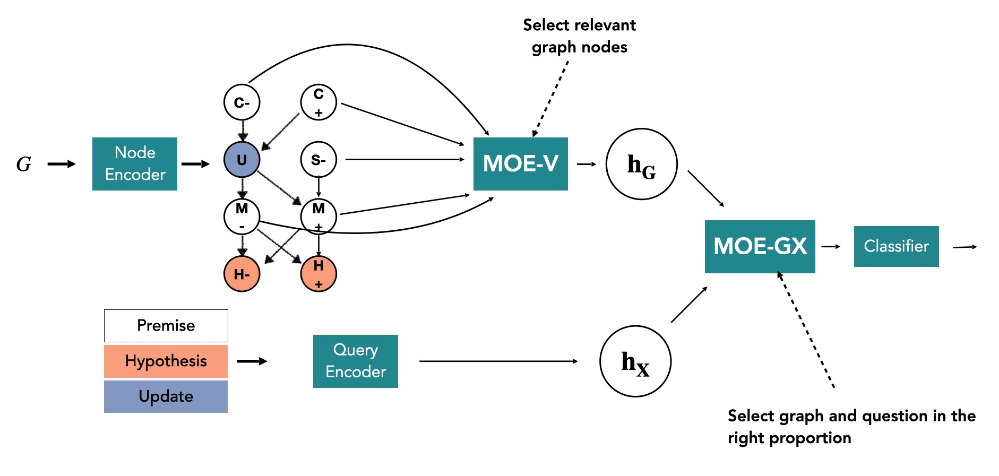

# *Think about it! Improving defeasible reasoning by first modeling the question scenario*



Code and data *Think about it! Improving defeasible reasoning by first modeling the question scenario* (EMNLP 2021)

## Setting up

- Download the pre-trained models from [here](https://drive.google.com/file/d/1QKSnMLpt0TfM-Jxu-eI-c92qHSjcIAov/view?usp=sharing) (or if you use gdown, you can run `gdown --id 1QKSnMLpt0TfM-Jxu-eI-c92qHSjcIAov` to directly download the models zip (23GB)).

- Download the data directory from [here](https://drive.google.com/drive/folders/1iexS3RrtSl3T2B2fGDCz9m0nVotula8x?usp=sharing) and unzip in the the root folder (or run `gdown --id 1iexS3RrtSl3T2B2fGDCz9m0nVotula8x`).

## Use cases

1. **Inference**

- Use `scripts/table5.sh` to run inference for all models/dataset. This will recreate the numbers presented in Table 5 in the paper.

- Each output file contains per-sample inferred and true labels, as well as the MOE gate values if applicable.

2. **Training**

- You can run training using `scripts/train.sh` script.
  
Usage:

```sh
scripts/train.sh MODEL_TYPE DATA_DIR GRAPH_NAME GPU
```

where:
    - MODEL_TYPE: one of `str`, `moe`, `gcn`, `gcn_moe`
    - DATA_DIR: path to the directory containing the dataset.
    - GRAPH_NAME: name of the graph to be used for training.
    - GPU: GPU to use. If not specified, will use the first available GPU.

- For example, to train an moe model on atomic dataset with cleaned graph, run:

```sh
    scripts/train.sh moe data/defeasible_graph_augmented_qa/t5/atomic/influence_graphs_cleaned.jsonl 0
 ```

- Sample unit test data is located in `data/unit_test`. The following command runs a unit test:

```sh
bash scripts/train.sh moe data/unit_test/ influence_graphs.jsonl 0
```

## Data and pre-trained models

- [Data documentation](docs/data.md).

- [Pre-trained models documentation](docs/pretrained_models.md)

---


